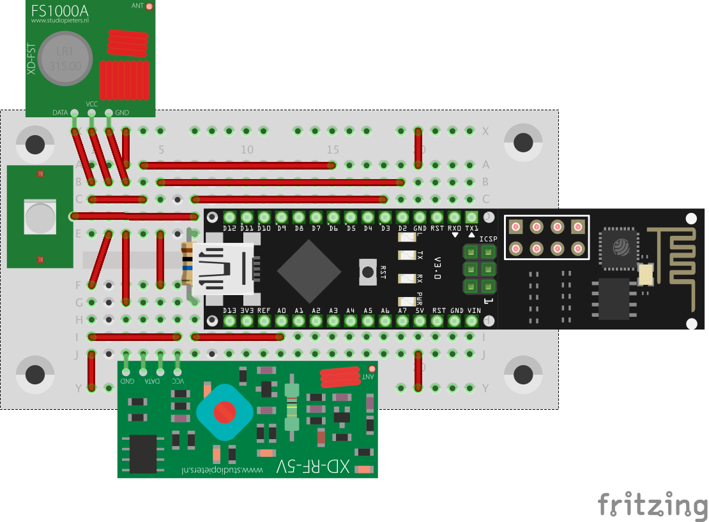

# arduino-rc-control

## Introduction
This project is an attempt at creating a simple home automation solution using just a few remote controlled plugs and a NanoESP with a bunch of sensors/senders. On top of that I had to find a replacement for the electronic of a capacitive touch switch in my furniture. That way, a few lamps and a garden fountain can be switched on and off.

Control...
* ... different sets of plugs and other radio controlled equipment using the standard 433 MHz remote control.
* ... any number of actors using a capacitive touch sensor
* ... any number of actors using a simple HTTP request and/or iOS app (soon)

**Note: This is my first arduino project. I assume that C++ "constant correctness" does not work properly, so I almost completely removed const modifiers in the code.**

Open issues:
* write desctructors for cleaning up heap space (even though some things are most probably never being disposed of any way)
* improve reliability when switching actors with the various input commands
+ maybe add a small capacitor to capactive touch sensor input
* add iOS app

## Components
* 1 breadboard
* 1 NanoESP Wifi module
* 1 10 MOhm resistor
* 1 capacitive touch sensor
* 1 sender and 1 receiver for 433 MHz remote commands [Amazon](https://www.amazon.de/gp/product/B071J2Z3YK/ref=oh_aui_detailpage_o02_s01?ie=UTF8&psc=1)

## Setup
Wire everything up as in this diagram:


## Used libraries
* Fabian Kainkas [NanoESP library](https://github.com/FKainka/NanoESP)
* Suat Özgürs [RC Switch](https://github.com/sui77/rc-switch)
* Paul Stoffregens [Capacitive sensor library](https://github.com/PaulStoffregen/CapacitiveSensor)

## How to customize
* switch on receiver debug output using `RC_DEBUG_OUTPUT` switch and collect codes using remote control
* define unused codes for group switching using the same method
* put actors and groups in `GroupBundle.cpp` file
* modify the JSON definition in the `index` variable to reflect your configuration (if you want to create a dynamic app that is)
* create a `passwords.h` file as in the example below

Example `passwords.h`file:
```
#ifndef PASSWORDS_H
#define PASSWORDS_H

#define SSID "myWifiSsid"
#define PASSWORD "mySuperSecureWifiPassword"

#endif
```

Using the codes on your gadge that have been unused so far (different house codes for example), groups of actors can be defined. If your wifi connection has been established successfully you should be able to switch your groups using a browser or even curl using the following simple requests (where 10 is one of the group's IDs):
```
curl http://<arduino-ip>?id=10\&state=on
curl http://<arduino-ip>?id=10\&state=off
```

## Find any problems?
Please feel free to submit any pull requests if you spot any problems or port stuff to other platforms.
 
